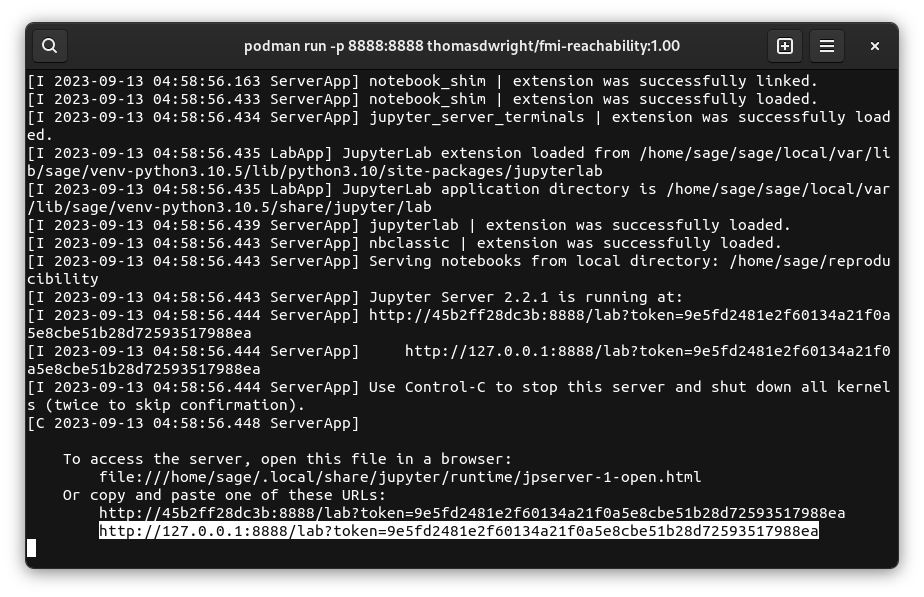
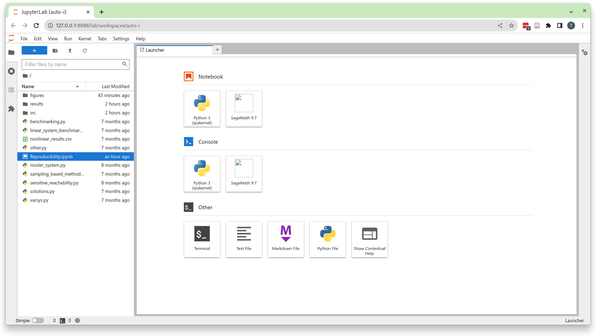
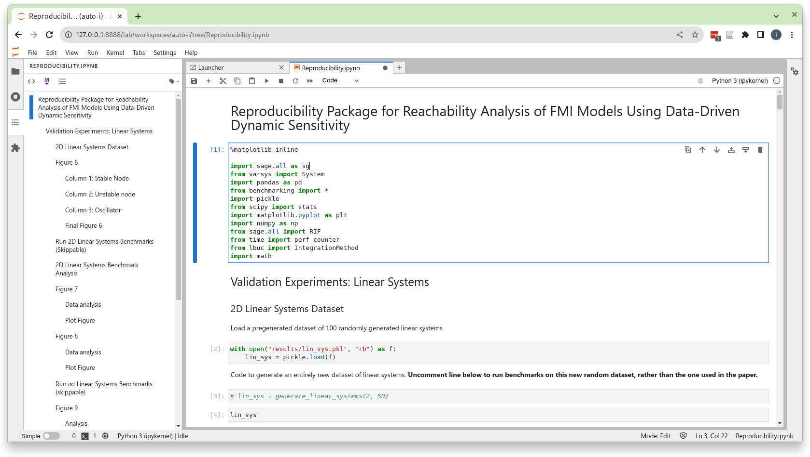

# FMI Reachability Reproducibility Package

This repository contains data, code, and instructions for the reproducibility package for the paper "Reachability Analysis of FMI Models
Using Data-Driven Dynamic Sensitivity".

## Content

The main contents of this repository are:
 - ``Reproducibility.ipynb``: A Jupyter notebook demonstrating how the main validation exercises of paper are carried out, and how each of the main figures are plotted.
 - ``experimental_code``: A folder containing code implementing each of the methods discussed in the paper, as well as datasets and figures from the paper.

## Instructions

The reproducibility package is contained in the Docker image [thomasdwright/fmi-reachability/](https://hub.docker.com/repository/docker/thomasdwright/fmi-reachability/). This contains all of the code from this repository, as well as additional dependencies making it easy to run the reproducibility package your own system.

In order to run this you will need a working [Docker client](https://docs.docker.com/desktop/) installed.

Then you can run the package via the terminal command ``docker run -p 8888:8888 thomasdwright/fmi-reachability:1.00``.

This will first download the image (this may take a while) and then launch a Jupyter lab server instance. You can then access this server in your web browser by opening the link provided in the command output:

This should open a web browser containing a Jupyter lab instance with the environment for the reproducibility package:

You should use this to open the ``Reproducibility.ipynb`` notebook (displayed on the left hand panel), which contains the main reproducibility package:

